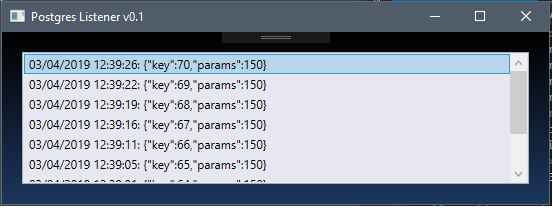

# PgListener

Exploratory WPF application to listen to a given postgres server notification channel.

Application uses a dedicated thread to connect and listen to Postgres and updates a WPF Listbox
each time a notification is received.

## Notes

The project has hardcoded values for:

* Postgres Host
* Postgres Port
* Postgres Username / Password
* Postgres Database
* Postgres Notification channel [fixtures]

It's meant to demonstrate how the notifications can be received and displayed onto a WPF Gui.